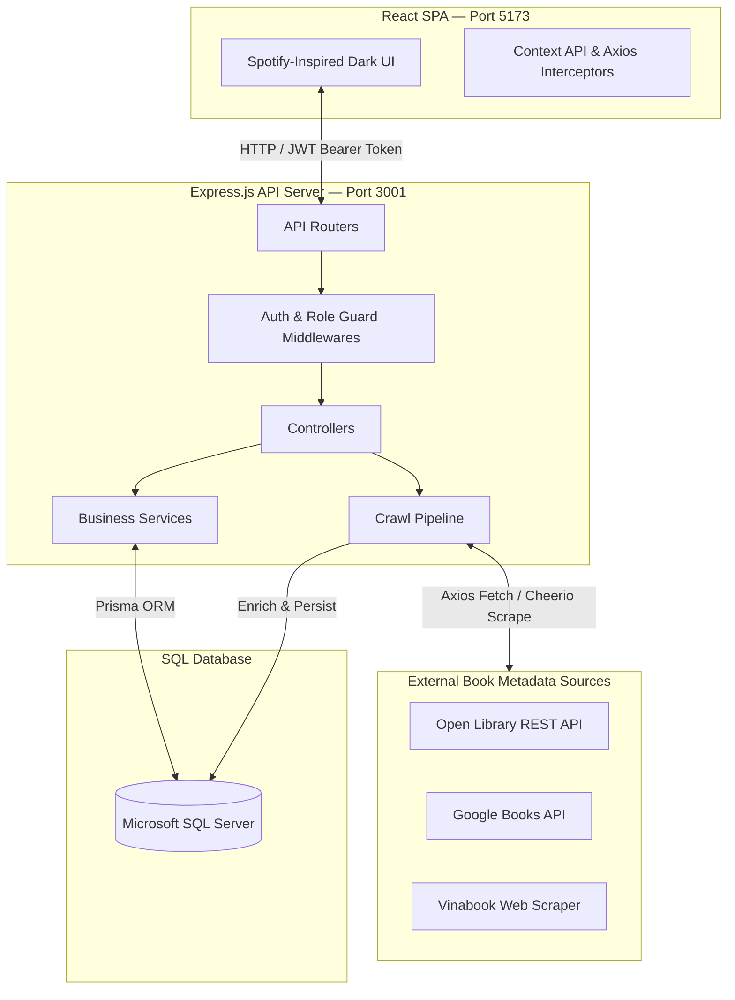
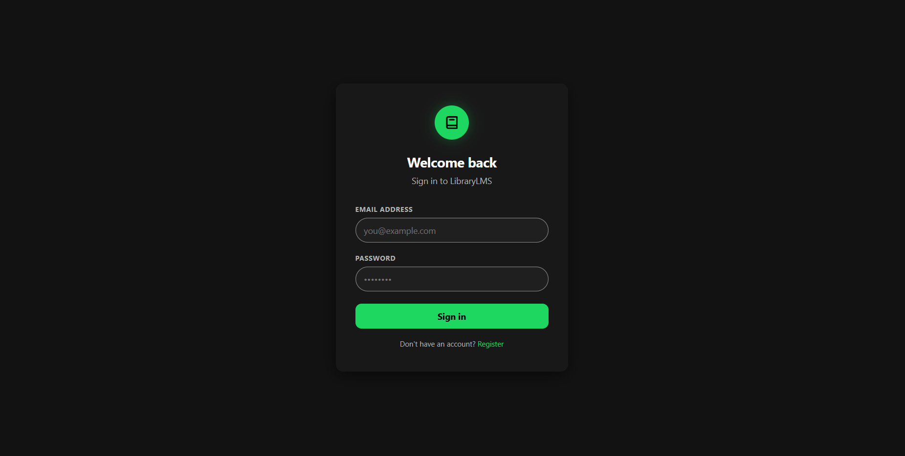
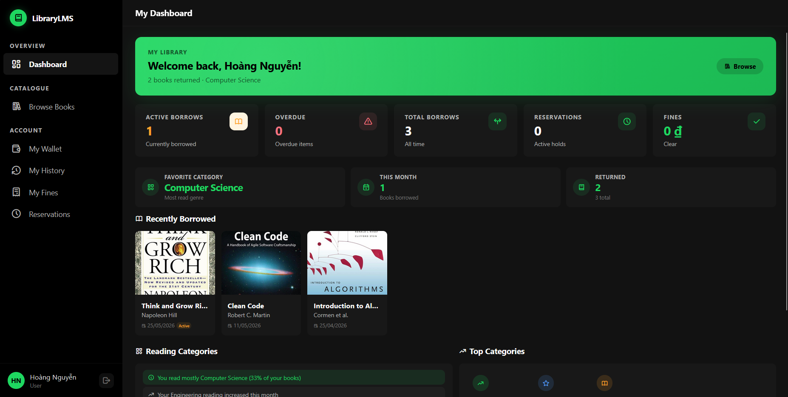
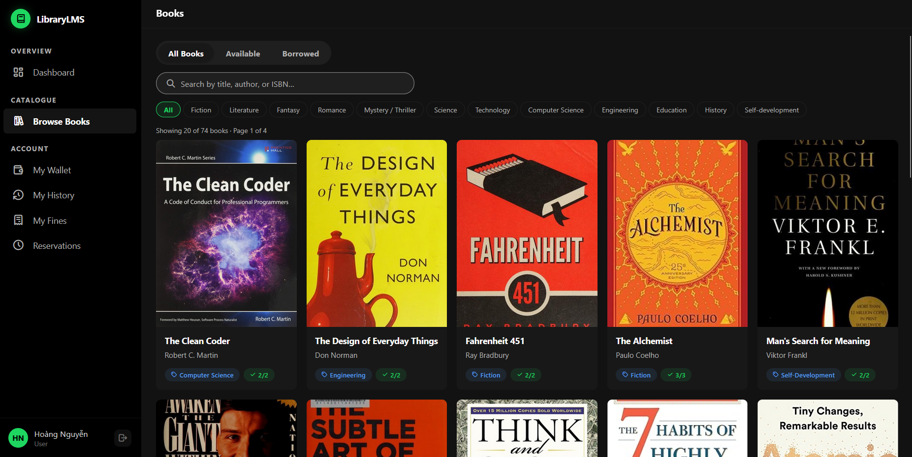

# 📚 LibraryLMS — Monolithic Library Management System

> **SE104 — Introduction to Software Engineering**
> University of Information Technology (UIT)
>
> A production-grade, monolithic web application designed to digitize core library operations. Features a **Spotify-inspired dark UI**, a **multi-source metadata enrichment pipeline**, an **integrated digital wallet & payment system**, and **priority-based book reservation queues**.

---

## 📖 Table of Contents

1. [Project Overview](#-project-overview)
2. [System Architecture](#-system-architecture)
3. [Technology Stack](#-technology-stack)
4. [Aesthetics & Design System](#-aesthetics--design-system)
5. [Database Schema](#-database-schema)
6. [Core Features](#-core-features)
7. [Project Structure](#-project-structure)
8. [Installation & Setup](#-installation--setup)
9. [API Endpoint Reference](#-api-endpoint-reference)
10. [Architecture Decision Records & Implementation Rules](#-architecture-decision-records--implementation-rules)

---

## 🎯 Project Overview

**LibraryLMS** is a full-stack monolithic web application built for the **SE104 (Introduction to Software Engineering)** course at **UIT**. It digitizes the day-to-day operations of a university or community library — covering account management, book catalogue control, borrow/return transactions, automated fine handling, digital wallet top-ups, book reservations, and real-time dashboard analytics.

### Target Users & Roles

| Role | Access Level | Responsibilities |
| :--- | :--- | :--- |
| **Librarian** (Staff / Admin) | Staff Dashboard | Book catalogue CRUD, member management, issuing borrows, processing returns, managing fines, reviewing crawl logs |
| **Reader** (Student / Patron) | Reader Dashboard | Browse catalogue, view borrow history, manage digital wallet, pay fines, reserve books, receive notifications |

---

## 🏗️ System Architecture

The application follows a classic **three-tier monolithic architecture**, tightly integrating the frontend presentation layer, server-side application logic, and relational data persistence into a single deployable unit.



### Request–Response Lifecycle

1. **Client Request** — The React SPA fires an API request via `axios`. A request interceptor automatically injects the JWT as an `Authorization: Bearer <token>` header on every outbound call.
2. **Routing & Security** — Express maps the incoming route. `authMiddleware` validates and decodes the JWT. `roleGuard` verifies role-based permissions (e.g., a `user`-role request to `/api/users` is rejected with `403 Forbidden`).
3. **Input Validation** — `express-validator` sanitizes and validates query parameters and request bodies, enforcing constraints such as ISBN-13 format and required fields.
4. **Service Delegation** — Controllers remain deliberately thin. All business logic — fine rate calculations, queue priority evaluation, crawl data merging — is encapsulated in dedicated Service modules.
5. **ORM / Database** — Prisma executes type-safe queries against the **Microsoft SQL Server** backend, handling migrations and connection pooling.
6. **Structured Response** — Every endpoint returns a consistent JSON envelope:

```json
{
  "success": true,
  "data": { "...": "..." },
  "message": "Operation successful"
}
```

---

## 💻 Technology Stack

| Layer | Technology | Version | Description | Why Chosen |
| :--- | :--- | :---: | :--- | :--- |
| **Frontend** | React | 18 | Declarative component-based UI | Industry-standard; rich ecosystem and composable state model |
| **Build Tool** | Vite | Latest | Dev server & ESM bundler | Sub-second HMR; significantly faster than CRA or Webpack |
| **Styling** | Tailwind CSS | v3 | Utility-first CSS framework | Rapid layout iteration without naming collisions or dead CSS |
| **State & Fetching** | Context API + Axios | — | Global state & HTTP client | Lightweight global state; Axios interceptors handle auth headers automatically |
| **Animations** | Framer Motion | Latest | Declarative motion library | Smooth page transitions and micro-animations with minimal boilerplate |
| **Backend** | Express.js | v4 | Minimal Node.js web framework | Unopinionated routing and middleware pipeline; easy to extend |
| **Runtime** | Node.js | v18+ | JavaScript runtime | Single language (JS/JSX) across the entire stack |
| **ORM** | Prisma | Latest | Type-safe database client | Auto-generated migrations, schema introspection, and rich DX |
| **Database** | MS SQL Server | 2019+ | Relational storage engine | Aligns with course specifications; handles complex nested joins |
| **Web Crawling** | Axios + Cheerio | — | HTTP client & HTML parser | Lightweight scraping and REST API consumption without a headless browser |
| **Authentication** | jsonwebtoken + bcrypt | — | Stateless sessions & password hashing | Stateless JWT sessions; bcrypt provides secure salted password storage |

---

## 🎨 Aesthetics & Design System

The UI is built on a custom **Spotify-inspired dark theme** defined via CSS custom properties in `client/src/index.css`.

### Color Palette

| Token | Hex Value | Usage |
| :--- | :--- | :--- |
| `--bg-base` | `#121212` | Page and sidebar background |
| `--bg-elevated` | `#181818` | Card and panel backgrounds |
| `--bg-highlight` | `#242424` | Hover states, table rows |
| `--bg-press` | `#000000` | Deep press / overlay states |
| `--accent-green` | `#1ED760` | Primary buttons, active nav, badges, CTAs |
| `--text-primary` | `#FFFFFF` | Headings and primary labels |
| `--text-subdued` | `#A7A7A7` | Secondary labels, metadata, placeholders |

### Design Principles

**Dark Immersive Canvas** — Deep charcoal and black backgrounds cause structural elements to visually recede, allowing book cover artwork to supply dynamic color and hierarchy.

**Spotify Green Accent** — `#1ED760` is used exclusively as the single interactive accent. It appears on primary buttons, active navigation indicators, wallet balance highlights, and notification badges.

**Pill & Circle Geometry** — Search bars and primary buttons use extreme border-radius values (`9999px`) to form full pills. User avatars, action icon buttons, and media controls use `50%` circles. No square corners exist on interactive elements.

**Dense Information Layout** — Content is packed at high density with minimal whitespace, mirroring modern music dashboard interfaces. Excess margins are removed in favor of content coverage.

**Elevation & Depth** — Layering is communicated via shadow, not borders. Dialog modals, slide-out panels, and hover cards use `rgba(0, 0, 0, 0.5) 0px 8px 24px` to create clear z-axis separation without visible border lines.

---

## 🗄️ Database Schema

The database is designed in **Third Normal Form (3NF)** and defined in `server/prisma/schema.prisma`.

```
+--------------+        +-----------------+        +---------------+
|     User     |-----<  |  BorrowRecord   |-----<  |  BorrowItem   |
| (Librarian / |        | (header record; |        | (line item;   |
|   Reader)    |        |  status, dates) |        |  per-book)    |
+------+-------+        +--------+--------+        +-------+-------+
       |                         |                         |
       |                         v                         v
       |                +--------+--------+        +-------+-------+
       |                |      Fine       |        |     Book      |
       |                | (overdue charge |        |  (catalogue)  |
       |                |  2,000 VND/day) |        +-------+-------+
       |                +--------+--------+                | 1:1
       |                         |                         v
       v                         v                +--------+--------+
+------+-------+        +--------+--------+       |  BookMetadata  |
|    Wallet    |-----<  |   FinePayment   |       | (cover, desc,  |
| (balance &   |        | (audit ledger)  |       |  ratings, src) |
| transactions)|        +-----------------+       +----------------+
+--------------+
       |
       v
+------+-------+
| Reservation  |
| (queue order)|
+--------------+
       |
       v
+--------------+
| Notification |
| (in-app msgs)|
+--------------+
```

### Model Reference

| Model | Key Fields | Description |
| :--- | :--- | :--- |
| **User** | `id`, `email`, `password_hash`, `role`, `is_active` | Stores credentials and role (`librarian` or `user`). Supports account activation toggling. |
| **Book** | `id`, `isbn13`, `title`, `author`, `total_quantity`, `available_quantity`, `is_deleted` | Core catalogue record. Soft-deleted via `is_deleted` flag. Inventory managed via quantity fields. |
| **BookMetadata** | `book_id (1:1)`, `cover_url`, `description`, `publisher`, `page_count`, `rating`, `crawl_source` | Enrichment data fetched and merged by the crawl pipeline. One-to-one with `Book`. |
| **BorrowRecord** | `id`, `user_id`, `status`, `borrow_date`, `due_date`, `return_requested` | Transaction header. Supports multi-book checkouts via child `BorrowItem` rows. |
| **BorrowItem** | `id`, `borrow_record_id`, `book_id` | One row per book in a transaction. Links the header record to specific catalogue entries. |
| **Fine** | `id`, `borrow_record_id`, `amount_vnd`, `is_paid` | Auto-calculated at return: `overdue_days × 2,000 VND`. Remains unpaid until settled via wallet. |
| **FinePayment** | `id`, `fine_id`, `wallet_id`, `amount_vnd`, `paid_at` | Immutable payment audit ledger entry created when a fine is cleared. |
| **Wallet** | `id`, `user_id`, `balance_vnd` | Per-reader digital wallet. Balance updated on top-up and fine payment operations. |
| **WalletTransaction** | `id`, `wallet_id`, `type`, `amount_vnd`, `created_at` | Append-only ledger for all wallet credits and debits (`topup`, `fine_payment`, `refund`). |
| **Reservation** | `id`, `user_id`, `book_id`, `queue_position`, `status`, `notified_at` | Queue record created when `available_quantity == 0`. Ordered by creation time. |
| **Notification** | `id`, `user_id`, `message`, `is_read`, `created_at` | In-app transactional messages (overdue reminders, reservation-ready alerts). |
| **CrawlLog** | `id`, `book_id`, `source`, `status`, `ran_at`, `error_message` | Diagnostic history of all crawler runs, including per-source success or failure details. |

---

## ⚡ Core Features

### 1. Real-Time Analytics Dashboard

**Librarian Dashboard** displays:
- Total catalogue volumes and active system users
- Count of active checkouts and currently overdue borrows
- Aggregated outstanding fine balance (in VND)
- Detailed table of all overdue borrow records with borrower contact details

**Reader Dashboard** displays:
- Currently borrowed books with due dates and return status
- Wallet balance and recent transaction history
- Active reservation queue positions
- Unread in-app notification count and message list

### 2. Multi-Book Borrow & Return Transactions

- Librarians can check out up to **3 books per transaction** using the header-detail borrow model.
- `available_quantity` is atomically decremented on checkout and restored on confirmed return.
- Readers can submit a **Return Request** via the Reader Dashboard; librarians confirm the physical receipt to finalize the transaction and trigger fine calculation.

### 3. Automated Fine Calculation

- Fines are computed automatically at the moment of return confirmation.
- Rate: **2,000 VND per overdue day** (`return_date − due_date` in days, if positive).
- A `Fine` record is created and linked to the `BorrowRecord`. No manual entry is required from staff.

### 4. Integrated Digital Wallet & Fine Payment

- Each reader has a unique `Wallet` record with a `balance_vnd` field.
- Readers can top up their wallet via the **Wallet** page.
- Outstanding fines can be paid in a single action; the system atomically deducts the fine amount from the wallet balance and writes a `FinePayment` audit record.
- All credits and debits are logged as immutable `WalletTransaction` entries, providing a transparent financial ledger.

### 5. Metadata Enrichment Crawl Pipeline

**Auto-Crawl on Create** — Adding a new book with a valid ISBN-13 automatically triggers a background enrichment job.

**Multi-Source Merging** — The crawler queries three sources in parallel and merges the best available data:

| Source | Method | Data Provided |
| :--- | :--- | :--- |
| Open Library REST API | HTTP GET | Cover images, author data, publish year, page count |
| Google Books API | HTTP GET | Publisher, description, language, ratings |
| Vinabook | Cheerio HTML scraper | Vietnamese edition metadata, local pricing context |

**Batch Enrichment** — Librarians can queue a batch enrichment run for all catalogue entries missing metadata. Requests are dispatched with concurrency limits and polite delays to avoid rate-limiting.

**CrawlLog Diagnostics** — Each run writes a `CrawlLog` record capturing the source, result status, and any error messages, giving staff full visibility into pipeline health.

### 6. Priority-Based Reservation Queues

- Readers may reserve a book when `available_quantity == 0`.
- A `Reservation` record is created with an auto-assigned `queue_position` based on creation timestamp.
- When a copy is returned, the system identifies the front-of-queue reservation, updates its status to `ready`, and dispatches a `Notification` to that reader.
- Readers may cancel their reservation at any time, which triggers a queue re-index for all positions behind the cancelled slot.

---

## 📁 Project Structure

```
final-project/
│
├── client/                          # React Single Page Application (Vite)
│   ├── src/
│   │   ├── assets/                  # Static icons, logos, and illustration files
│   │   ├── components/              # Reusable UI components
│   │   │   ├── common/              # Buttons, badges, modals, input fields
│   │   │   └── layout/              # Sidebar, topbar, navigation guards
│   │   ├── contexts/
│   │   │   └── AuthContext.jsx      # Global auth state; JWT storage & refresh
│   │   ├── layouts/
│   │   │   └── MainLayout.jsx       # Shared page shell (sidebar + outlet)
│   │   ├── pages/                   # Route-level page components
│   │   │   ├── Dashboard/           # Role-specific dashboard views
│   │   │   ├── Books/               # Catalogue listing and detail pages
│   │   │   ├── Borrows/             # Borrow management and history
│   │   │   ├── Wallet/              # Wallet balance, top-up, fine payment
│   │   │   ├── Reservations/        # Queue listing and management
│   │   │   └── Users/               # Member management (Librarian only)
│   │   ├── services/
│   │   │   └── api.js               # Axios instance with base URL and interceptors
│   │   └── utils/
│   │       ├── currency.js          # VND formatting helpers
│   │       └── date.js              # Due-date and overdue-day calculators
│   ├── tailwind.config.js           # Tailwind theme extensions and color tokens
│   └── vite.config.js               # Vite bundler config (proxy, aliases)
│
├── server/                          # Node.js + Express Backend
│   ├── prisma/
│   │   ├── schema.prisma            # Database schema and model definitions
│   │   └── seed.js                  # Sample data seeder (users, books, borrows)
│   ├── src/
│   │   ├── config/
│   │   │   └── db.js                # Prisma client singleton initializer
│   │   ├── controllers/             # Thin request handlers; parse input, call services
│   │   │   ├── authController.js
│   │   │   ├── bookController.js
│   │   │   ├── borrowController.js
│   │   │   ├── walletController.js
│   │   │   └── reservationController.js
│   │   ├── middlewares/
│   │   │   ├── authMiddleware.js    # JWT verification and user attachment
│   │   │   └── roleGuard.js         # Role-based access control enforcement
│   │   ├── routes/                  # Express router definitions
│   │   │   ├── authRoutes.js
│   │   │   ├── bookRoutes.js
│   │   │   ├── borrowRoutes.js
│   │   │   ├── walletRoutes.js
│   │   │   ├── reservationRoutes.js
│   │   │   └── userRoutes.js
│   │   ├── services/                # Business logic layer
│   │   │   ├── fineService.js       # Overdue day calculation; fine creation logic
│   │   │   ├── reservationService.js# Queue management and re-indexing
│   │   │   ├── walletService.js     # Balance deduction and transaction logging
│   │   │   └── notificationService.js
│   │   ├── crawlers/                # Metadata enrichment pipeline
│   │   │   ├── openLibraryCrawler.js
│   │   │   ├── googleBooksCrawler.js
│   │   │   ├── vinabookCrawler.js
│   │   │   └── crawlOrchestrator.js # Merge logic and CrawlLog persistence
│   │   └── validators/              # express-validator schema rule definitions
│   │       ├── bookValidator.js     # ISBN-13 format, required fields
│   │       └── borrowValidator.js   # Max 3 books, valid IDs
│   └── server.js                    # Entry point; mounts routers, starts listener
│
├── DESIGN.md                        # Full UI/UX design specification
├── IMPLEMENTATION_RULES.md          # Engineering constraints and ADRs
└── README.md                        # This file
```

---
## Demo Visualization

| Login Screen | Dashboard | Book Browsing |
|---|---|---|
|  |  |  |
## ⚙️ Installation & Setup

### Prerequisites

| Requirement | Minimum Version | Notes |
| :--- | :---: | :--- |
| Node.js | v18.0.0 | Download from [nodejs.org](https://nodejs.org) |
| npm | v9.0.0 | Bundled with Node.js v18+ |
| Microsoft SQL Server | 2019 | Developer or Express edition is sufficient for local setup |

### Step 1 — Database Setup

1. Ensure MS SQL Server is running and accessible.
2. Create a new database (e.g., `library_db`) using SQL Server Management Studio or `sqlcmd`:
   ```sql
   CREATE DATABASE library_db;
   ```
3. Note your server hostname, port (`1433` by default), login credentials, and database name — you will need them in Step 2.

### Step 2 — Backend Setup

```bash
# Navigate to the server directory
cd server

# Install all Node.js dependencies
npm install

# Copy the environment variable template and populate your values
cp .env.example .env
```

Edit `.env` with your configuration:

```env
# Server
PORT=3001

# Database — Microsoft SQL Server connection string
DATABASE_URL="sqlserver://localhost:1433;database=library_db;user=SA;password=YourStrongPassword;encrypt=true;trustServerCertificate=true;"

# Authentication — use a long, randomly generated string (min. 32 characters)
JWT_SECRET="replace_with_a_long_cryptographically_random_secret_key"

# CORS — must match the frontend origin exactly
CLIENT_URL="http://localhost:5173"
```

```bash
# Generate the Prisma client and apply the initial database migration
npx prisma migrate dev --name init

# Seed the database with sample librarian accounts, readers, and books
npx prisma db seed

# Start the Express development server (with hot reload via nodemon)
npm run dev
```

The API server will be available at `http://localhost:3001`.

### Step 3 — Frontend Setup

```bash
# Navigate to the client directory (from project root)
cd client

# Install all Node.js dependencies
npm install

# Start the Vite development server
npm run dev
```

Open [http://localhost:5173](http://localhost:5173) in your browser. The Vite dev server is pre-configured to proxy API requests to `http://localhost:3001`.

### Default Seed Credentials

| Role | Email | Password |
| :--- | :--- | :--- |
| Librarian | `librarian@uit.edu.vn` | `admin123` |
| Reader | `reader@uit.edu.vn` | `user123` |

> ⚠️ **Security Notice:** Change all seed account passwords immediately in any environment beyond local development.

---

## 🔌 API Endpoint Reference

All endpoints return the standardized response envelope:
```json
{ "success": true | false, "data": { ... }, "message": "..." }
```

Authentication is required on all routes except `POST /api/auth/register` and `POST /api/auth/login`. Pass the JWT as `Authorization: Bearer <token>`.

### 🔐 Authentication — `/api/auth`

| Method | Endpoint | Auth Required | Role | Description |
| :---: | :--- | :---: | :--- | :--- |
| `POST` | `/api/auth/register` | No | — | Registers a new reader account. |
| `POST` | `/api/auth/login` | No | — | Authenticates a user; returns a signed JWT and the user profile object. |
| `GET` | `/api/auth/me` | Yes | Any | Returns the profile of the currently authenticated user. |

### 📚 Catalogue Management — `/api/books`

| Method | Endpoint | Auth Required | Role | Description |
| :---: | :--- | :---: | :--- | :--- |
| `GET` | `/api/books` | Yes | Any | Lists all catalogue entries. Supports `?search=`, `?author=`, and pagination query params. |
| `GET` | `/api/books/:id` | Yes | Any | Returns full details and metadata for a single book. |
| `POST` | `/api/books` | Yes | Librarian | Creates a new book and triggers the background metadata crawl pipeline. |
| `PUT` | `/api/books/:id` | Yes | Librarian | Updates editable fields of a catalogue entry (title, author, quantity, etc.). |
| `DELETE` | `/api/books/:id` | Yes | Librarian | Soft-deletes a book (`is_deleted = true`). The record is retained in the database. |

### 👥 Member Management — `/api/users`

| Method | Endpoint | Auth Required | Role | Description |
| :---: | :--- | :---: | :--- | :--- |
| `GET` | `/api/users` | Yes | Librarian | Returns all user accounts. Supports `?role=` filter. |
| `POST` | `/api/users` | Yes | Librarian | Creates a new account (can create both reader and librarian roles). |
| `PUT` | `/api/users/:id` | Yes | Librarian | Updates a member's name, email, or other profile fields. |
| `PATCH` | `/api/users/:id/toggle-active` | Yes | Librarian | Toggles the `is_active` flag, locking or unlocking a user's ability to log in. |

### 🔄 Borrows & Returns — `/api/borrows`

| Method | Endpoint | Auth Required | Role | Description |
| :---: | :--- | :---: | :--- | :--- |
| `POST` | `/api/borrows` | Yes | Librarian | Creates a checkout record. Validates max 3 books per transaction. Decrements `available_quantity` for each book. |
| `GET` | `/api/borrows` | Yes | Librarian | Returns all borrow records system-wide. Supports `?status=active\|overdue\|returned` filter. |
| `GET` | `/api/borrows/my` | Yes | Reader | Returns the authenticated reader's full borrowing history. |
| `PATCH` | `/api/borrows/:id/return` | Yes | Librarian | Confirms physical book return. Restores `available_quantity`, computes overdue days, and creates a `Fine` record if applicable. |
| `PATCH` | `/api/borrows/:id/request-return` | Yes | Reader | Allows a reader to signal intent to return a book, surfacing it in the librarian's pending returns queue. |

### 💳 Digital Wallet — `/api/wallet`

| Method | Endpoint | Auth Required | Role | Description |
| :---: | :--- | :---: | :--- | :--- |
| `GET` | `/api/wallet` | Yes | Reader | Returns the reader's current wallet balance and full transaction history. |
| `POST` | `/api/wallet/topup` | Yes | Reader | Credits a specified amount (in VND) to the reader's wallet. Creates a `WalletTransaction` record of type `topup`. |
| `POST` | `/api/wallet/pay-fine` | Yes | Reader | Deducts a fine amount from the wallet balance. Creates `FinePayment` and `WalletTransaction` records atomically. Returns `400` if balance is insufficient. |

### ⏳ Reservations — `/api/reservations`

| Method | Endpoint | Auth Required | Role | Description |
| :---: | :--- | :---: | :--- | :--- |
| `POST` | `/api/reservations` | Yes | Reader | Joins the reservation queue for a book. Only permitted when `available_quantity == 0`. |
| `GET` | `/api/reservations/my` | Yes | Reader | Returns all active and historical reservations for the authenticated reader, including current queue position. |
| `DELETE` | `/api/reservations/:id` | Yes | Reader | Cancels an active reservation. Triggers queue re-indexing for all positions behind the cancelled slot. |

### 🔔 Notifications — `/api/notifications`

| Method | Endpoint | Auth Required | Role | Description |
| :---: | :--- | :---: | :--- | :--- |
| `GET` | `/api/notifications` | Yes | Reader | Returns all notifications for the authenticated reader, ordered by recency. |
| `PATCH` | `/api/notifications/:id/read` | Yes | Reader | Marks a specific notification as read (`is_read = true`). |

### 🕷️ Crawl Pipeline — `/api/crawl`

| Method | Endpoint | Auth Required | Role | Description |
| :---: | :--- | :---: | :--- | :--- |
| `POST` | `/api/crawl/:bookId` | Yes | Librarian | Manually triggers the enrichment crawl for a single book by ID. |
| `POST` | `/api/crawl/batch` | Yes | Librarian | Queues a batch enrichment run for all books currently missing metadata. |
| `GET` | `/api/crawl/logs` | Yes | Librarian | Returns the full `CrawlLog` history, showing per-source statuses and error details. |

---

## 🛠️ Architecture Decision Records & Implementation Rules

All contributors must adhere to the constraints defined in [`IMPLEMENTATION_RULES.md`](./IMPLEMENTATION_RULES.md). The key rules are summarized below.

### ADR-01 — JavaScript Only

TypeScript is **not permitted** in this project. All server and client code must remain `.js` or `.jsx`. Do not introduce type annotation files, `tsconfig.json`, or TypeScript-specific dependencies.

**Rationale:** Keeps the learning surface focused on software engineering concepts rather than type system mechanics for an introductory course project.

### ADR-02 — Microsoft SQL Server is the Exclusive Database Engine

The Prisma `datasource` provider **must remain `sqlserver`**. PostgreSQL, MySQL, SQLite, and any other database engines are **strictly prohibited**.

```prisma
// ✅ REQUIRED
datasource db {
  provider = "sqlserver"
  url      = env("DATABASE_URL")
}
```

**Rationale:** Aligns with the database systems taught in the UIT curriculum.

### ADR-03 — Business Logic Lives in Services, Not Controllers

Controllers must remain **thin**. Their only responsibilities are:
- Extracting and validating request inputs
- Calling the appropriate service method
- Mapping the service result to a JSON response

All business rules — fine calculation, queue management, crawl data merging, inventory enforcement — belong in `src/services/`. Controllers **must not** contain conditional business logic.

### ADR-04 — API Response Shape is Frozen

The shape of all seeded API response objects **must not be altered**. Adding, removing, or renaming top-level fields in response payloads is prohibited without a corresponding frontend update and team review.

**Rationale:** Prevents silent frontend regressions caused by backend response shape drift.

### ADR-05 — Preserve the Spotify-Inspired Dark Theme

All UI contributions must comply with the design system documented in [`DESIGN.md`](./DESIGN.md). Specific constraints:

- Gray CSS borders (`border: 1px solid #ccc`) are **prohibited** for elevation. Use `box-shadow` instead.
- The accent color `#1ED760` may only be used for interactive elements and active states, not decorative purposes.
- Typography must remain dense. Do not increase `line-height` or `letter-spacing` beyond the defined design tokens.
- All new components must use the CSS custom properties defined in `index.css`, not hardcoded hex values.

### ADR-06 — Soft Delete Only

Books must never be hard-deleted from the database. Always set `is_deleted = true`. This preserves `BorrowItem` and `Fine` referential integrity for historical records.
